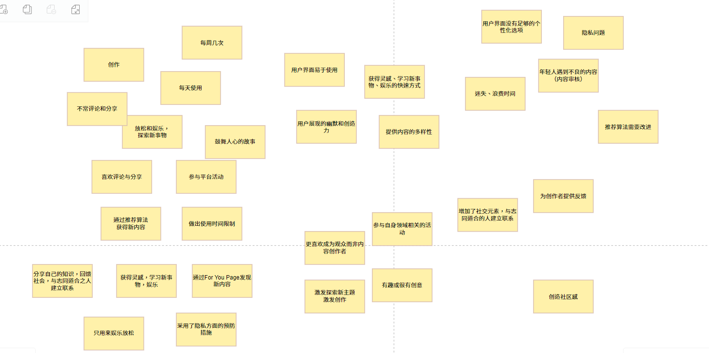
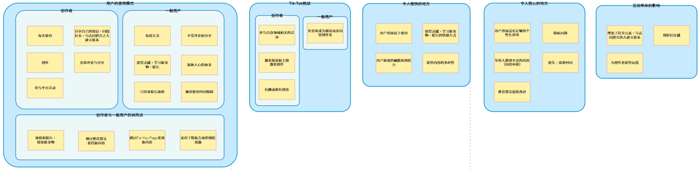
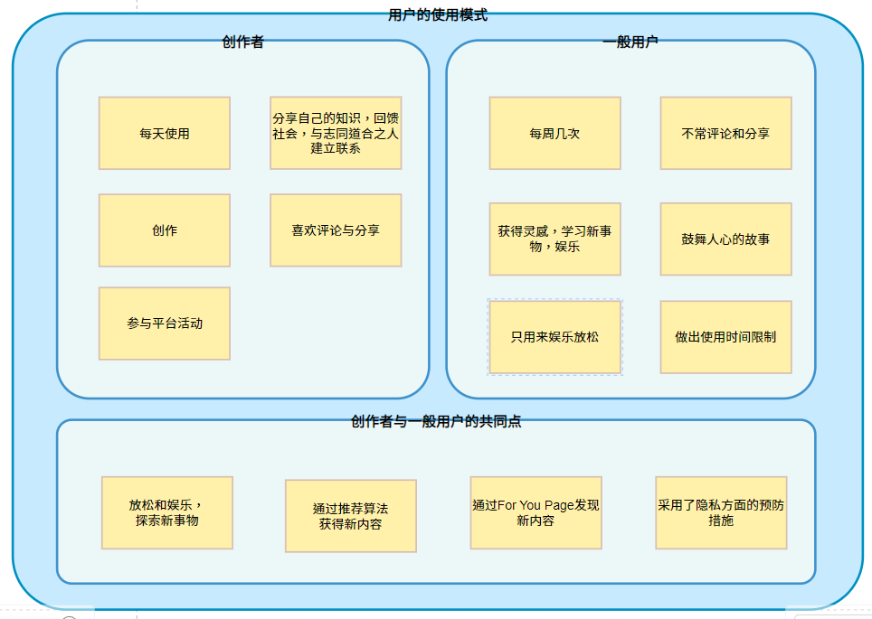
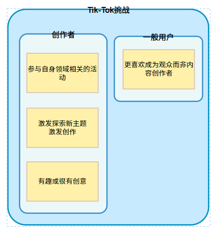
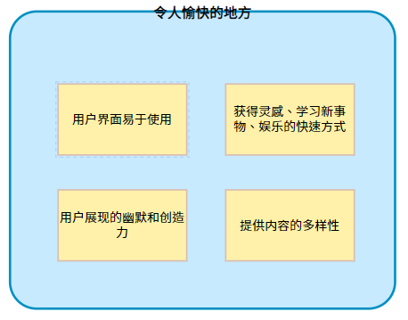
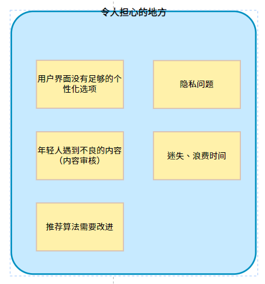
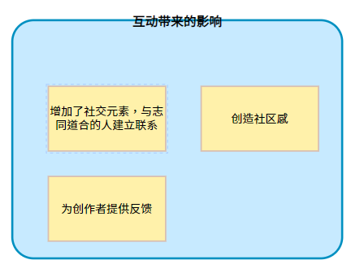

# HCI
## Team Intro 

Team member：刘沛戬、牟家慧、皮亚杰

## Project Proposal 

1. Assessing the interviewee's usage patterns, including how often they use Tik-Tok and the type of content they engage with the most.

2. Understanding what aspects of Tik-Tok are enjoyable for the interviewee and identifying any challenges or issues they have encountered.

3. Exploring how Tik-Tok fits into the interviewee's daily life and whether it has had any significant impact on their routines.

4. Assessing the interviewee's content creation and participation in Tik-Tok challenges or trends, if applicable.

5. Identifying the interviewee's goals and objectives in using Tik-Tok, as well as what they hope to achieve from their interactions on the platform.

6. Delves into privacy and user experience aspects, including concerns about data security, user interface satisfaction, content moderation, screen time management, and future improvements.

## Affinity Diagram

## Data Collection Plan

### Interview

#### Questions

Thank you for joining us today. Your insights are greatly appreciated. I am collecting data for a research project about Tik-Tok, is it alright if I use your response as part of my project? You may find some of my questions too personal, if you are uncomfortable with answering them just let me know and I will move on. I want to assure you that your responses will remain confidential. Do you have any questions for me before I start?

**Warm Up**

Q1. Please provide some basic demographic information:

Q2. Let us start, could you briefly describe your typical day or routine, including how Tik-Tok fits into your daily life?

**-Main Body-**

* Topic 1: Tik-Tok Usage and Experience

Q1. Can you tell me about your experience with Tik-Tok? How often do you use it, and what kind of content do you engage with the most?

Q2. What do you find most enjoyable about Tik-Tok? Conversely, are there any challenges or issues you've encountered while using it?

Q3. How has Tik-Tok impacted your daily life or routines? Can you provide specific examples of how you've used Tik-Tok for various purposes?

Q4. Have you ever created content on Tik-Tok? If so, what motivated you to start creating, and what has been your experience as a content creator?

Q5. Are there any specific goals or objectives you have in mind when using Tik-Tok? What do you hope to achieve or gain from your interactions on the platform?

* Topic 2: Content Discovery and Interactions

Q1. How do you discover new content and creators on Tik-Tok? Do you engage with specific trends or challenges?

Q2. Can you describe your interactions with other Tik-Tok users, such as likes, comments, or sharing content? How important are these interactions to you?

Q3. Have you participated in any Tik-Tok challenges or trends? If yes, please share your experience and whether it influenced your content creation or viewing habits.

Q4. What are your preferences when it comes to the types of content you enjoy on TikTok? Are there specific genres or themes that resonate with you?

Q5. Do you feel that Tik-Tok's algorithm effectively tailors content to your interests, or do you sometimes encounter content that doesn't align with your preferences?

* Topic 3: Privacy and User Experience

Q1. Tik-Tok has faced privacy concerns in the past. How do you feel about the privacy and security of your data on Tik-Tok, and what precautions, if any, do you take?

Q2. How satisfied are you with the user interface and design of the Tik-Tok app? Are there any features or improvements you'd like to see?

Q3. Are there any concerns or issues related to Tik-Tok's content moderation, algorithms, or community guidelines that you'd like to address?

Q4. How do you handle your Tik-Tok usage in terms of screen time and managing its impact on your daily life?

Q5. Looking ahead, what do you think Tik-Tok could do to enhance your overall experience on the platform?

**-Closing-**

Is there anything else you'd like to share or any additional feedback you have about your Tik-Tok experience?

### survey

#### Questions

Users‘ Overall Tik-Tok experience and opinions 

You can draw ✓ on [ ] and O to select

Q1. Is it alright if I use your response as part of my project?

[ ]  Yes [ ]  No

Q2. Please provide some basic information:

Age:		[ ] Prefer not to say

Gender:	[ ] Male [ ] Female [ ] Other [ ] Prefer not to say

Job:		[ ] Prefer not to say

Q3. How frequently do you use TikTok? 

[ ]  Multiple times a day

[ ]  Daily

[ ]  Weekly

[ ]  Monthly

[ ]  Rarely

[ ]  Never

Q4. What kind of content do you engage with the most on Tik-Tok? (Select all that apply)

[ ] Comedy

[ ] Music and dance [ ] DIY and tutorials

[ ] Educational content

[ ] Challenges and trends

[ ] Others (please specify):  

Q5. On a scale of 1 to 5, how satisfied are you with your overall experience on Tik-Tok?

Very        	Very

Dissatisfied  Satisfied

O  O  O  O  O

1   2   3   4   5

Q6. Have you ever created content on Tik-Tok? 

[ ]  Yes [ ]  No

Q7. If you've created content, what motivated you to start creating on Tik-Tok, and what has been your experience as a content creator?

Q8. How has Tik-Tok impacted your daily life or routines? Please provide specific examples.

Q9. Do you have specific goals or objectives when using Tik-Tok? What do you hope to achieve or gain from your interactions on the platform?

Q10. How do you primarily discover new content and creators on Tik-Tok? [ ] Explore the 'For You' page

[ ] Follow hashtags related to my interests

[ ] Follow specific creators

[ ] Other (please specify):  

Q11. Which types of interactions do you engage in on Tik-Tok? (Select all that apply) [ ] Liking videos

[ ] Commenting on videos

[ ] Sharing content with others 

[ ] None of the above

[ ] Others (please specify):     

Q12. Have you participated in any Tik-Tok challenges or trends? If yes, please share your experience and whether it influenced your content creation or viewing habits.

Q13. Do you feel that Tik-Tok's algorithm effectively tailors content to your interests? 

[ ]  Yes [ ]  No

Q14. How do you feel about the privacy and security of your data on Tik-Tok? 

[ ] Very Secure

[ ] Somewhat Secure 

[ ] Neutral

[ ] Somewhat Concerned 

[ ] Very Concerned

Q15. How satisfied are you with the user interface and design of the Tik-Tok app? 

[ ] Very Satisfied

[ ] Satisfied 

[ ] Neutral

[ ] Dissatisfied

[ ] Very Dissatisfied

Q16. Is there anything else you'd like to share or any additional feedback you have

about your Tik-Tok experience?

Q17. Would you like to participate in future research interviews/surveys?

[ ] I would be interested in participating in future research interviews/surveys. 

[ ] I prefer not to participate in future research interviews/surveys.

Thank you for your participation!
